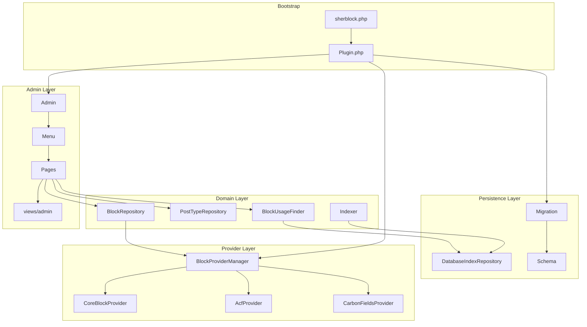

# SherBlock Architecture Guide

This document is the authoritative reference for how SherBlock is structured, how code should be written, and how new functionality should be added. When in doubt, follow this guide.

---

## Table of contents

1. [What SherBlock is](#what-sherblock-is)
2. [Requirements](#requirements)
3. [Directory layout](#directory-layout)
4. [Architectural principles](#architectural-principles)
5. [Layer overview](#layer-overview)
6. [Data flow](#data-flow)
7. [Namespaces & autoloading](#namespaces--autoloading)
8. [PHP conventions](#php-conventions)
9. [WordPress conventions](#wordpress-conventions)
10. [Module reference](#module-reference)
11. [Adding new functionality](#adding-new-functionality)
12. [Admin UI guidelines](#admin-ui-guidelines)
13. [Database guidelines](#database-guidelines)
14. [Caching & logging](#caching--logging)
15. [Security](#security)
16. [Internationalization](#internationalization)
17. [Testing](#testing)
18. [Anti-patterns](#anti-patterns)
19. [Implementation roadmap](#implementation-roadmap)

---

## What SherBlock is

SherBlock is a **Gutenberg inspection tool** for WordPress administrators and developers. It answers:

- Which blocks are registered on this site?
- Which post types support the block editor?
- Where is a specific block used?
- Which blocks appear on a given post type?

SherBlock is **not** a block library, page builder, or front-end rendering plugin. It reads, indexes, and surfaces information about existing Gutenberg content.

### Core capabilities

| Capability | Description |
|------------|-------------|
| Block discovery | Find blocks from WordPress core, ACF, Carbon Fields, and future providers |
| Usage tracking | Parse `post_content` with `parse_blocks()` and index block-to-post relationships |
| Admin UI | List/detail views for blocks and Gutenberg-enabled CPTs |
| Custom indexing | Store usage in custom DB tables for fast queries at scale |

---

## Requirements

| Dependency | Version |
|------------|---------|
| WordPress | 6.0+ |
| PHP | 8.0+ |
| Composer | Required for PSR-4 autoloading |

After cloning or pulling, always run:

```bash
cd wp-content/plugins/sherblock
composer install
```

The plugin will not boot without `vendor/autoload.php`. An admin notice is shown if Composer dependencies are missing.

### Plugin constants

Defined in `sherblock.php` and available globally:

| Constant | Purpose |
|----------|---------|
| `SHERBLOCK_VERSION` | Plugin version string |
| `SHERBLOCK_FILE` | Absolute path to main plugin file |
| `SHERBLOCK_PATH` | Plugin directory path (trailing slash) |
| `SHERBLOCK_URL` | Plugin directory URL (trailing slash) |

---

## Directory layout

```
sherblock/
├── sherblock.php              # Plugin bootstrap (constants, autoload, boot)
├── uninstall.php              # Cleanup on plugin deletion
├── composer.json              # PSR-4 autoload config
├── README.md                  # User-facing overview
├── architecture.md            # This file — dev bible
│
├── src/                       # All PHP application code (PSR-4)
│   ├── Plugin.php             # Singleton bootstrap, service wiring, hooks
│   │
│   ├── Admin/
│   │   ├── Admin.php          # Admin subsystem entry point
│   │   ├── Menu.php           # Top-level menu + submenu registration
│   │   ├── Assets.php         # Admin CSS/JS enqueue
│   │   └── Pages/
│   │       ├── BlockListPage.php
│   │       ├── BlockDetailPage.php
│   │       ├── CptListPage.php
│   │       └── CptDetailPage.php
│   │
│   ├── Blocks/
│   │   ├── Block.php                  # Block value object
│   │   ├── BlockRegistry.php          # In-memory block store
│   │   ├── BlockRepository.php        # Block data access
│   │   ├── BlockRepositoryInterface.php
│   │   └── BlockUsageFinder.php       # "Where is block X used?"
│   │
│   ├── Index/
│   │   ├── Indexer.php                # Orchestrates indexing
│   │   ├── IndexBuilder.php           # parse_blocks() → index rows
│   │   ├── IndexRepositoryInterface.php
│   │   └── DatabaseIndexRepository.php
│   │
│   ├── PostTypes/
│   │   ├── PostType.php               # PostType value object
│   │   ├── PostTypeRepository.php
│   │   ├── PostTypeRepositoryInterface.php
│   │   └── BlockSupportChecker.php
│   │
│   ├── Providers/
│   │   ├── BlockProviderInterface.php
│   │   ├── BlockProviderManager.php
│   │   ├── CoreBlockProvider.php
│   │   ├── AcfProvider.php
│   │   └── CarbonFieldsProvider.php
│   │
│   ├── Database/
│   │   ├── Schema.php                 # Table definitions (dbDelta SQL)
│   │   └── Migration.php              # Create/update/drop tables
│   │
│   └── Support/
│       ├── Logger.php
│       └── Cache.php
│
├── views/
│   └── admin/                 # PHP view templates (presentation only)
│       ├── blocks/
│       │   ├── list.php
│       │   └── detail.php
│       └── post-types/
│           ├── list.php
│           └── detail.php
│
├── assets/                    # (future) admin CSS/JS — not yet created
├── languages/                 # (future) .pot / .po translation files
└── tests/                     # PHPUnit tests (PSR-4: SherBlock\Tests\)
```

### File placement rules

| What you're adding | Where it goes |
|--------------------|---------------|
| New block source integration | `src/Providers/{Name}Provider.php` |
| New admin screen | `src/Admin/Pages/{Name}Page.php` + `views/admin/...` |
| New data query | Repository interface + implementation in the relevant module |
| New value object | Same module as the domain concept (e.g. `src/Blocks/`) |
| New DB table | `src/Database/Schema.php` + repository methods |
| Cross-cutting utility | `src/Support/` |
| WordPress hook registration | `src/Plugin.php` (or delegate to a dedicated class if hooks grow large) |

---

## Architectural principles

SherBlock uses a **layered, WordPress-native architecture**. It is structured and testable, but not a full application framework.

### 1. Separation of concerns

```
┌─────────────────────────────────────────────────────────┐
│  Admin Pages (controllers)                              │
│  register() + render() — fetch data, load views         │
├─────────────────────────────────────────────────────────┤
│  Views (presentation)                                   │
│  HTML only — no business logic, no DB queries           │
├─────────────────────────────────────────────────────────┤
│  Repositories & Finders (data access)                   │
│  Query and persist — no HTML output                     │
├─────────────────────────────────────────────────────────┤
│  Services (Indexer, ProviderManager, BlockSupportChecker)│
│  Orchestrate domain operations                          │
├─────────────────────────────────────────────────────────┤
│  Value Objects (Block, PostType)                        │
│  Typed, immutable data carriers — not arrays              │
├─────────────────────────────────────────────────────────┤
│  Providers (pluggable discovery)                        │
│  One class per block registration source                │
├─────────────────────────────────────────────────────────┤
│  WordPress / $wpdb APIs                                 │
└─────────────────────────────────────────────────────────┘
```

### 2. Repositories own data access

- **Do** put `$wpdb` queries, `get_posts()`, and index reads/writes in repository classes.
- **Do not** query the database or call `parse_blocks()` inside view files or admin page `render()` methods beyond delegating to a service/repository.

### 3. Value objects over arrays

Pass `Block` and `PostType` objects between layers. Avoid `array( 'name' => ..., 'title' => ... )` through the codebase. Arrays are acceptable at persistence boundaries (DB rows, `parse_blocks()` output) and should be mapped to value objects as early as possible.

### 4. Interfaces at persistence and provider boundaries

Define an interface when:

- Multiple implementations are plausible (`IndexRepositoryInterface`, `BlockRepositoryInterface`)
- External systems vary (`BlockProviderInterface`)

Do **not** interface everything. Simple support classes (`Logger`, `Cache`, `BlockSupportChecker`) do not need interfaces unless testing demands it.

### 5. Plugin.php is the composition root

`Plugin::registerServices()` is where dependencies are constructed and injected. As the plugin grows, wire new services here. Avoid `new SomeRepository()` inside page classes — inject via constructor when wiring matures.

### 6. Keep it WordPress, not Laravel

- No service container, no facades, no Eloquent, no routing layer.
- Use `add_action` / `add_filter`, `admin_menu`, `dbDelta`, transients, and `$wpdb`.
- Manual constructor injection in `Plugin.php` is sufficient.

---

## Layer overview



---

## Data flow

### Block discovery

```
BlockProviderManager::discoverAll()
    → each BlockProviderInterface::discoverBlocks()
    → returns Block[] value objects
    → BlockRegistry::registerMany()
    → BlockRepository::findAll() / findByName()
    → Admin page passes Block[] to view
```

### Block usage indexing

```
save_post hook
    → Indexer::indexPost( $postId )
    → load post_content
    → IndexBuilder::buildFromContent()  [uses parse_blocks()]
    → IndexRepository::deleteByPost( $postId )
    → IndexRepository::store() for each block found
```

### Block usage lookup

```
BlockDetailPage::render()
    → BlockRepository::findByName( $blockName )
    → BlockUsageFinder::findPostsUsingBlock( $blockName )
    → IndexRepository::findByBlock()
    → view renders usage table
```

### CPT block summary

```
CptDetailPage::render()
    → PostTypeRepository::findByName( $postType )
    → IndexRepository::findByPostType( $postType )
    → view renders block frequency table
```

---

## Namespaces & autoloading

### PSR-4 mapping

Configured in `composer.json`:

| Namespace prefix | Directory |
|------------------|-----------|
| `SherBlock\` | `src/` |
| `SherBlock\Tests\` | `tests/` (dev) |

### Namespace ↔ folder mapping

Namespaces mirror the folder structure under `src/`:

```
src/Blocks/Block.php           → SherBlock\Blocks\Block
src/Admin/Pages/BlockListPage.php → SherBlock\Admin\Pages\BlockListPage
src/Providers/AcfProvider.php  → SherBlock\Providers\AcfProvider
```

### Rules

- One class per file.
- File name must match class name: `BlockRepository.php` → `class BlockRepository`.
- Use `declare(strict_types=1);` as the first statement after `<?php` in every file under `src/` and `tests/`.
- Root namespace is always `SherBlock`. Do not use `SherBlock\Src` or nested vendor-style paths.
- After adding new classes, run `composer dump-autoload` (or `composer install`).

### Import style

```php
use SherBlock\Blocks\Block;
use SherBlock\Blocks\BlockRepositoryInterface;

// Prefer imports over fully-qualified inline names.
// Group: SherBlock imports first, then WordPress/global, then vendor.
```

---

## PHP conventions

### Version & strictness

- Target **PHP 8.0+** features: typed properties, union types, `readonly`, constructor promotion, `?self`, `mixed` return where appropriate.
- Every file: `declare(strict_types=1);`
- Prefer `final` on concrete classes unless extension is an explicit design goal.

### Class design

```php
<?php
/**
 * Short description of the class.
 *
 * @package SherBlock\Blocks
 */

declare(strict_types=1);

namespace SherBlock\Blocks;

/**
 * Longer docblock if the class role is non-obvious.
 */
final class Example {

    public function __construct(
        private readonly BlockRegistry $registry,
    ) {
    }

    /**
     * @return Block[]
     */
    public function findAll(): array {
        // ...
    }
}
```

### Method signatures

- Always declare parameter types and return types.
- Use `void` for methods that return nothing.
- Use `?Type` for nullable returns, not implicit null.
- Document array shapes in PHPDoc when the type is `array`:

```php
/**
 * @param array<string, mixed> $meta
 * @return array<int, array<string, mixed>>
 */
```

### Naming

| Element | Convention | Example |
|---------|------------|---------|
| Classes | PascalCase | `BlockUsageFinder` |
| Interfaces | PascalCase + `Interface` suffix | `BlockProviderInterface` |
| Methods | camelCase | `findByName()` |
| Properties | camelCase | `$providerManager` |
| Constants | UPPER_SNAKE_CASE | `SLUG`, `MENU_SLUG` |
| Provider IDs | lowercase kebab-case strings | `'carbon-fields'` |

### Visibility

- Default to `private` for properties and helper methods.
- Use `public` only for the intentional API surface.
- Page classes expose `register()` and `render()` as public; `loadView()` stays private.

### Enums

Use PHP 8.1+ backed enums sparingly when a fixed set of states is shared across layers (e.g. index status). Prefer string constants on value objects for simple cases.

### Error handling

- Let WordPress APIs return `WP_Error` where natural; check with `is_wp_error()`.
- Do not wrap every call in try/catch. Use exceptions for truly exceptional failures in pure PHP logic.
- Log failures via `Support\Logger` — do not `error_log()` directly from domain code.

---

## WordPress conventions

### Hooks

| Hook | Registered in | Purpose |
|------|---------------|---------|
| `register_activation_hook` | `Plugin.php` | Run `Migration::run()` |
| `init` | `Plugin.php` | Text domain, scheduled tasks |
| `save_post` | `Plugin.php` | Re-index block usage for saved post |
| `admin_menu` | `Menu.php` | Register admin pages |
| `admin_enqueue_scripts` | `Assets.php` | Load admin assets on SherBlock screens |

When adding hooks:

1. Register in the appropriate class (`Plugin.php` for global, module class for scoped).
2. Use callable arrays `[ $this, 'method' ]` or named methods — avoid large anonymous closures except in `Plugin.php` bootstrap.
3. Document the hook and priority in a code comment if non-default.

### Capabilities

All admin pages use `manage_options` unless a narrower capability is justified later. Never use `edit_posts` for site-wide block inspection.

### Direct access guard

- `sherblock.php` and `uninstall.php`: `if ( ! defined( 'ABSPATH' ) ) { exit; }`
- View files: `defined( 'ABSPATH' ) || exit;`

### Database

- Use `$wpdb->prepare()` for all dynamic SQL values.
- Table names via `Schema::getBlockUsageTableName()` — never hardcode `wp_sherblock_*`.
- Schema changes go through `dbDelta()` in `Migration::run()`.
- Prefix all custom tables with `$wpdb->prefix . 'sherblock_'`.

### Options & transients

- Option keys: `sherblock_{name}` (e.g. `sherblock_index_version`).
- Transient keys: `sherblock_{name}` with TTL managed in `Support\Cache`.
- Delete all options/transients in `uninstall.php`.

### Coding standards

Follow [WordPress PHP Coding Standards](https://developer.wordpress.org/coding-standards/wordpress-coding-standards/php/) where they do not conflict with modern PHP:

- Use WordPress spacing in PHP files (spaces inside parentheses per WPCS).
- Use `$wpdb`, `get_post_types()`, `sanitize_text_field()`, `esc_html()`, etc. — not raw superglobals in views.
- Prefix global functions if any are ever added: `sherblock_*` (prefer classes over global functions).

---

## Module reference

### `Plugin.php`

| Responsibility | Details |
|----------------|---------|
| Singleton bootstrap | `Plugin::instance()->boot()` called from `sherblock.php` |
| Service wiring | `registerServices()` constructs all dependencies |
| Hook registration | `registerHooks()` — activation, init, save_post |

**Do not** put business logic here. Only composition and hook attachment.

---

### `Admin/`

| Class | Role |
|-------|------|
| `Admin` | Entry point; calls `Menu` and `Assets` when `is_admin()` |
| `Menu` | Registers top-level **SherBlock** menu and delegates to page classes |
| `Assets` | Enqueues CSS/JS only on hooks containing `sherblock` |
| `Pages\*` | One class per screen; `register()` + `render()` |

#### Admin page slugs

| Class | Constant | Visibility |
|-------|----------|------------|
| `BlockListPage` | `sherblock-blocks` | Visible submenu |
| `BlockDetailPage` | `sherblock-block-detail` | Hidden (`null` menu title) |
| `CptListPage` | `sherblock-cpts` | Visible submenu |
| `CptDetailPage` | `sherblock-cpt-detail` | Hidden (`null` menu title) |

Hidden pages are reached via query args from list views (e.g. `?page=sherblock-block-detail&block=core/paragraph`).

---

### `Blocks/`

| Class | Role |
|-------|------|
| `Block` | Immutable value object: name, title, category, provider, attributes, supports |
| `BlockRegistry` | In-memory `Block` store keyed by block name |
| `BlockRepository` | Hydrates registry from providers; serves `findAll`, `findByName`, `findByProvider` |
| `BlockRepositoryInterface` | Contract for block data access |
| `BlockUsageFinder` | Reads index to answer usage questions |

`Block::getName()` uses the full namespaced block name (e.g. `acf/hero`, `core/paragraph`).

---

### `Index/`

| Class | Role |
|-------|------|
| `Indexer` | Orchestrates per-post and full-site indexing |
| `IndexBuilder` | Parses content with `parse_blocks()`, walks `innerBlocks`, produces flat rows |
| `IndexRepositoryInterface` | `store`, `deleteByPost`, `findByBlock`, `findByPost`, `findByPostType` |
| `DatabaseIndexRepository` | `$wpdb` implementation against custom tables |

Indexing is **write-on-save** (via `save_post`) with optional full rebuild (`Indexer::indexAll()`).

---

### `PostTypes/`

| Class | Role |
|-------|------|
| `PostType` | Value object: name, label, supportsBlocks, isPublic |
| `PostTypeRepository` | Lists Gutenberg-enabled CPTs |
| `PostTypeRepositoryInterface` | Contract for CPT queries |
| `BlockSupportChecker` | Wraps `use_block_editor_for_post_type()` and related checks |

---

### `Providers/`

| Class | Role |
|-------|------|
| `BlockProviderInterface` | `getId()`, `isAvailable()`, `discoverBlocks()` |
| `BlockProviderManager` | Registers providers, calls `discoverAll()` |
| `CoreBlockProvider` | `WP_Block_Type_Registry` |
| `AcfProvider` | `acf_get_block_types()` when ACF is active |
| `CarbonFieldsProvider` | Carbon Fields block API when active |

Each provider returns `Block[]` with `provider` set to its `getId()`.

---

### `Database/`

| Class | Role |
|-------|------|
| `Schema` | Table names, `CREATE TABLE` SQL strings, charset collate |
| `Migration` | `run()` via `dbDelta()`, `drop()` on uninstall |

Planned table: `{prefix}sherblock_block_usage` — stores `post_id`, `block_name`, optional `meta` JSON, timestamps.

---

### `Support/`

| Class | Role |
|-------|------|
| `Logger` | `info`, `error`, `debug` — respects `WP_DEBUG` / `WP_DEBUG_LOG` |
| `Cache` | Wraps `wp_cache_*` and transients under group `sherblock` |

---

## Adding new functionality

### Add a new block provider (e.g. Lazy Blocks)

1. Create `src/Providers/LazyBlocksProvider.php` implementing `BlockProviderInterface`.
2. Implement:
   - `getId()` → `'lazy-blocks'`
   - `isAvailable()` → check plugin function/class exists
   - `discoverBlocks()` → map external definitions to `Block` value objects
3. Register in `Plugin::registerServices()`:

```php
$this->providerManager->register( new LazyBlocksProvider() );
```

4. No changes to `BlockRepository` or admin pages if mapping is correct.

---

### Add a new admin page

1. Create `src/Admin/Pages/MyNewPage.php` with `SLUG`, `register()`, `render()`.
2. Create view at `views/admin/{section}/{name}.php`.
3. Register in `Menu::registerMenus()`:

```php
$this->myNewPage->register();
```

4. Inject dependencies via constructor when `Plugin` wiring supports it.
5. In `render()`: fetch data from repositories, pass to `loadView()` — no HTML in the page class.

---

### Add a repository method

1. Add method to the **interface** first.
2. Implement in the concrete class (`BlockRepository`, `DatabaseIndexRepository`, etc.).
3. Consume from a page class or service — never from a view.
4. Add PHPUnit test under `tests/` mirroring namespace.

---

### Add a database table

1. Add SQL to `Schema::getTables()` and a `get{Name}TableName()` helper.
2. `Migration::run()` will pick it up via `dbDelta()`.
3. Add repository methods for read/write.
4. Add drop statement to `Migration::drop()` and `uninstall.php`.
5. Bump `sherblock_db_version` option when shipping schema changes.

---

### Add a WordPress hook

1. Decide scope: global (`Plugin.php`) vs admin-only (`Admin.php` or relevant page).
2. Keep the callback thin — delegate to a service method in one line.
3. Document why the hook exists.

---

### Add admin assets

1. Place files in `assets/css/` or `assets/js/`.
2. Enqueue in `Assets::enqueue()` gated on `$hook` containing `sherblock`.
3. Use `SHERBLOCK_VERSION` for cache busting.
4. Use `wp_enqueue_style` / `wp_enqueue_script` — no inline scripts in views.

---

## Admin UI guidelines

### Controller pattern

```php
public function render(): void {
    $blocks = $this->blockRepository->findAll();

    $this->loadView( 'blocks/list.php', compact( 'blocks' ) );
}
```

### View rules

- **Presentation only** — loops, `esc_html()`, `esc_url()`, minimal `if` for empty states.
- Document expected variables in a file-level `@var` PHPDoc block.
- Use `.wrap` and prefix CSS classes with `sherblock` (e.g. `sherblock-blocks-list`).
- No `new`, no `$wpdb`, no `parse_blocks()` in views.

### List tables

Prefer `WP_List_Table` for sortable/paginated lists when complexity warrants it. For simple lists, a plain `<table class="widefat">` is fine initially.

### Detail pages

- Read identifiers from `$_GET` with sanitization in the page class (`sanitize_text_field`, `sanitize_key`).
- Validate that the entity exists; show `wp_die()` or an admin notice if not.

---

## Database guidelines

### Table design principles

- Index on `block_name` and `post_id` for the usage table.
- Store only what queries need — denormalize post title/status at query time via `JOIN`, not in the index table.
- Use `LONGTEXT` or `JSON` for optional `meta` column if block attribute fingerprints are needed later.

### Migrations

- Always use `dbDelta()` — never raw `CREATE TABLE` without it on activation.
- Version the schema with an option `sherblock_db_version`.
- `Migration::run()` should be idempotent (safe to call multiple times).

### Uninstall

`uninstall.php` must:

1. Drop all SherBlock tables.
2. Delete all `sherblock_*` options and transients.
3. Never run on deactivation — only uninstall.

---

## Caching & logging

### When to cache

| Data | Cache? | TTL guidance |
|------|--------|--------------|
| Discovered blocks | Yes | Until `init` priority change or manual flush |
| Index query results | Optional | Short TTL or invalidate on `save_post` |
| Post type list | Yes | Until `registered_post_type` changes |

Use `Support\Cache` — do not call `set_transient()` directly from domain code.

### Logging

- `Logger::debug()` — development only.
- `Logger::info()` — indexing milestones, provider discovery counts.
- `Logger::error()` — failed migrations, indexing errors.

---

## Security

- **Capabilities**: `manage_options` on all admin screens.
- **Nonces**: Required for any form submission or AJAX that mutates data (re-index, settings).
- **Sanitization**: All `$_GET` / `$_POST` values sanitized in page classes before use.
- **Escaping**: All output escaped in views (`esc_html`, `esc_attr`, `esc_url`).
- **SQL**: Always `$wpdb->prepare()`.
- **Direct file access**: Guard every PHP file.
- **No eval, no unserialize** of untrusted data.

---

## Internationalization

- Text domain: `sherblock`
- Domain path: `/languages`
- Wrap all user-visible strings: `__( '...', 'sherblock' )`, `_e()`, `esc_html__()`, etc.
- Load text domain on `init` in `Plugin.php`:

```php
load_plugin_textdomain( 'sherblock', false, dirname( plugin_basename( SHERBLOCK_FILE ) ) . '/languages' );
```

---

## Testing

### Structure

```
tests/
├── Unit/
│   ├── Blocks/
│   ├── Index/
│   └── Providers/
└── bootstrap.php
```

- Namespace: `SherBlock\Tests\...`
- Run with PHPUnit (add `phpunit/phpunit` to `require-dev` when ready).
- Mock `BlockProviderInterface` and `IndexRepositoryInterface` — do not hit the database in unit tests.
- Integration tests (optional) may use WordPress test suite (`wp-phpunit`).

### What to test

| Layer | Test focus |
|-------|------------|
| `IndexBuilder` | Nested `innerBlocks` parsing, block name collection |
| Providers | `isAvailable()` guards, mapping to `Block` objects |
| Repositories | Query logic with mocked `$wpdb` |
| Value objects | Construction, getters |

---

## Anti-patterns

Do **not**:

| Anti-pattern | Why |
|--------------|-----|
| SQL or `parse_blocks()` in views | Breaks separation of concerns |
| Passing raw arrays instead of `Block` / `PostType` | Loses type safety and consistency |
| `new Repository()` inside page classes | Prevents testing and central wiring |
| Service container / DI package | Over-engineering for this plugin |
| Business logic in `sherblock.php` | Bootstrap only |
| Hardcoded table names | Use `Schema` helpers |
| Skipping `isAvailable()` in providers | Causes fatals when plugin inactive |
| Global state beyond `Plugin` singleton | Makes testing and reasoning harder |
| Feature code in `uninstall.php` | Uninstall is cleanup only |

---

## Implementation roadmap

Suggested build order for new contributors:

| Phase | Work | Key files |
|-------|------|-----------|
| 1 | Database schema + activation migration | `Schema`, `Migration`, `uninstall.php` |
| 2 | Core block discovery | `CoreBlockProvider`, `BlockRegistry`, `BlockRepository` |
| 3 | Index builder + repository | `IndexBuilder`, `DatabaseIndexRepository`, `Indexer` |
| 4 | `save_post` indexing hook | `Plugin.php` |
| 5 | Block list + detail admin UI | `BlockListPage`, `BlockDetailPage`, views |
| 6 | CPT support checker + list UI | `BlockSupportChecker`, `PostTypeRepository`, CPT pages |
| 7 | ACF + Carbon providers | `AcfProvider`, `CarbonFieldsProvider` |
| 8 | Caching, full re-index action, polish | `Cache`, `Logger`, admin tools |

---

## Quick reference checklist

Before opening a PR, confirm:

- [ ] `declare(strict_types=1);` on new PHP files
- [ ] PSR-4 namespace matches folder path
- [ ] `composer dump-autoload` run if classes added
- [ ] No business logic in views
- [ ] Data access in repositories, not pages
- [ ] User strings wrapped for i18n
- [ ] Output escaped, input sanitized
- [ ] `$wpdb->prepare()` for dynamic SQL
- [ ] New provider registered in `Plugin::registerServices()`
- [ ] Schema/uninstall updated if DB changed
- [ ] `architecture.md` updated if structure or conventions change

---

*This document should be updated whenever architecture, conventions, or folder structure changes. It is the single source of truth for SherBlock code structure.*
